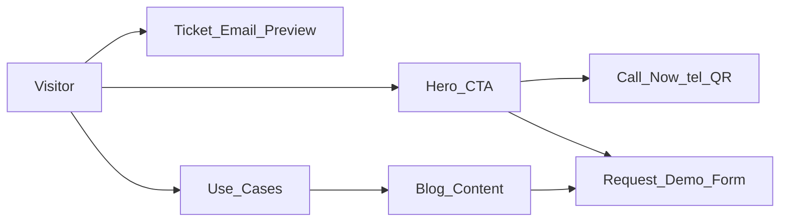

# Vercel Produktseite – Umsetzungsplan (granular)

## Kontext (aus deinem Projekt)

- Produktpositionierung: **Operational Incident Management** für unbeaufsichtigte Infrastruktur (Automatenmärkte, Parkhäuser, Cleanparks). Siehe z.B. `[skalierungsansätze/Skalierung Beschwerdemanagement B.md](skalierungsansätze/Skalierung Beschwerdemanagement B.md)`.
- Voice-Flow (Demo-relevant): Twilio → Ultravox Agent. Siehe `[workflows/Twillio zu Ultravox.json](workflows/Twillio zu Ultravox.json)`.
- Summary/Extraction/Weiterleitung: call.ended → Extraction → Übergabe an Analyse-Flow. Siehe `[workflows/Zusammenfassung Daten Auswahl.json](workflows/Zusammenfassung Daten Auswahl.json)`.
- Ticket/Email-HTML (Preview-relevant): HTML-Template wird im Flow generiert und per Mail versendet. Siehe `[workflows/Beschwerden Analyse Test.json](workflows/Beschwerden Analyse Test.json)`.

## Ziel

- Eine **deutsche** Produktseite auf **Vercel** mit:
  - **Startseite**: Voice-Demo (Call-to-action) + **Ticket-/Email-Preview** (HTML-ähnlich)
  - **SEO/AISO**: sehr gut indexierbar + maschinenlesbar
  - **Blog** (MDX) als Content-Hub
  - **Lead-Capture** (Demo-Anfrage) mit messbarer Conversion

## Architektur (Marketing-Website)

- **Next.js (App Router) auf Vercel**
- Rendering: primär **SSG** (optional ISR für Blog)
- Content: **MDX im Repo**
- Keine DB für Website

## UX-Flow (Startseite)

## Scope der Seiten (MVP)

- `/` Startseite (Voice-Demo + Ticket Preview + Use-Cases + CTA)
- `/produkt` Features + How-it-works
- `/use-cases/automaten`
- `/use-cases/parkhaus`
- `/use-cases/cleanpark`
- `/security` (Multi-Tenant Isolation, Daten/LLM-Firewall, DSGVO)
- `/preise`
- `/faq`
- `/demo`
- `/blog` + `/blog/[slug]`
- `/legal/impressum`, `/legal/datenschutz`

## Definition of Done (global)

- Jede Seite hat: **H1**, **Title**, **Description**, saubere interne Links.
- `sitemap.xml` enthält alle Seiten + Blogposts.
- Keine Index-Blocker in Prod (robots/noindex).
- Startseite erklärt das Produkt in <10 Sekunden (Headline + 1 Satz + CTA).

## Risiken/Entscheidungen (bewusst)

- Voice-Demo Phase 1: **„Jetzt anrufen“** (tel-Link + Nummer + QR auf Desktop). Das ist am schnellsten, zuverlässig und ohne WebRTC/Token/Browser-Audio-Komplexität.
- Ticket-Preview: als **React-Komponente**, die das Email-Layout nachbaut (statt HTML in iframe), damit SEO/Performance gut bleiben.

## Rollenmodell (Dev-Zuordnung)

### Rollen

- **Codex (unbegrenzt)**: strukturiert, stringent, fehlerarm → Owner für Setup/Architektur/Implementierung/Go-Live.
- **Gemini (unbegrenzt)**: sehr schnell, eher oberflächlich → Owner für Drafts (Copy, FAQs, Blog-Seed), Support für Boilerplate.
- **Opus (begrenzt)**: extrem lösungsstark → nur für knifflige Themen mit hohem Risiko/Impact (Security-Claims, AISO/SEO-Strategie-Review, ggf. Voice Phase 2).
- **Sonnet (begrenzt)**: sehr guter Senior, teuer → punktuell für Conversion-/Brand-Copy und UI-Polish (Startseite, Pricing, ausgewählte Posts).

### Steuerungsregeln (damit Opus/Sonnet nicht „verbrannt“ werden)

- **Opus nur auf Review/High-risk Deliverables** einplanen (max. 2 kurze Slots: Security + SEO/AISO Review).
- **Sonnet in 1–2 geblockten Sessions**: Startseite (Hero/Story) + optional Pricing/Polish.
- Alles andere: **Codex baut**, **Gemini liefert Draft-Content**, Codex/Sonnet prüfen je nach Risiko.

### Owner/Support/Review pro Todo

- Siehe Frontmatter `todos:` oben: jedes Todo enthält **owner**, **support** und **review** (und ggf. `notes`).

